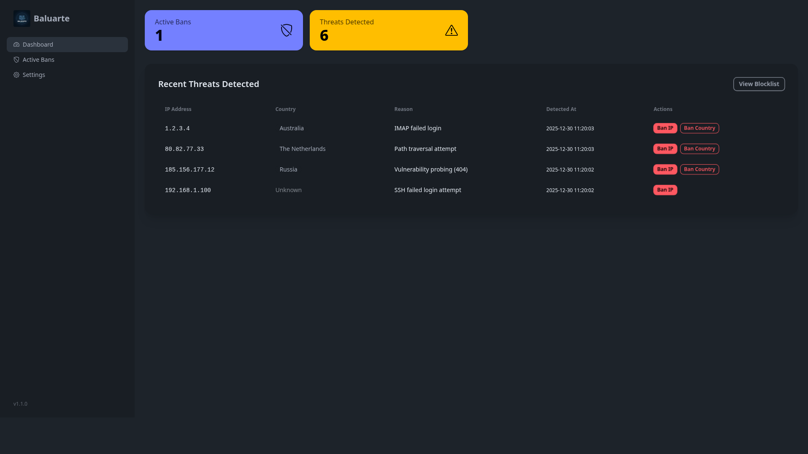
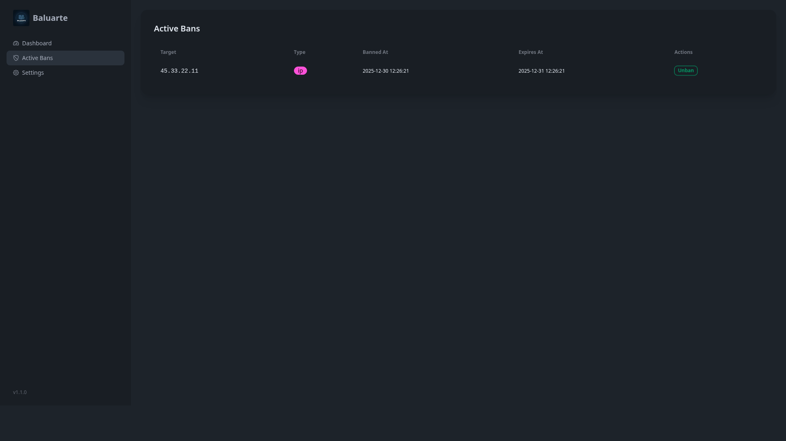
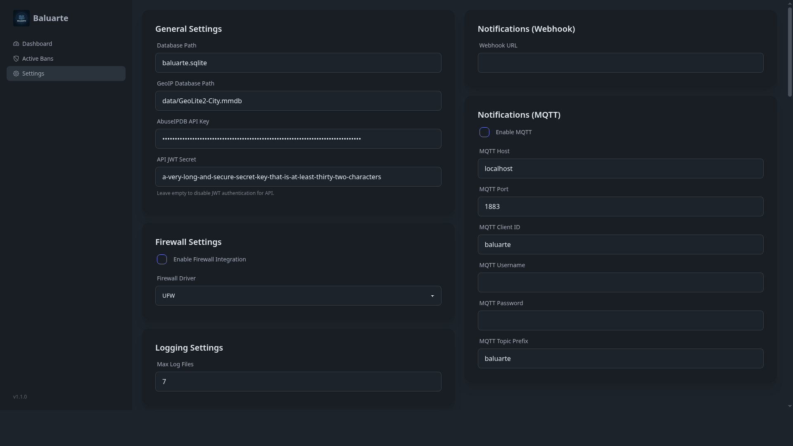

# Baluarte 🛡️

[](https://www.php.net/)
[](LICENSE)
[](https://github.com/peopleandpixel/baluarte/releases)
[](https://github.com/peopleandpixel/baluarte/pkgs/container/baluarte)
[](baluarte.service)

> **Ban unwanted hosts, domains & IPs from your network — godless easy.**  
> Log scanner + Auto-blocker for Linux servers. systemd journal, files, JSON → ufw/iptables/nftables + AbuseIPDB + GeoIP + MQTT + REST API + 2FA Dashboard.

---

## 🎯 What It Does

| Input | Detection | Action |
|-------|-----------|--------|
| **systemd journal** | SSH failed logins (pam_unix, sshd) | Auto-ban IP after N attempts |
| **Log files** (nginx, apache, postfix, dovecot, custom) | Regex patterns (SQLi, XSS, path traversal, WP login, etc.) | Block + alert |
| **JSON logs** (structured logging) | Field-based rules | Block + enrich |

**Integrations:** AbuseIPDB (reputation), MaxMind GeoIP2 (country/city/ASN), MQTT (Home Assistant, Node-RED), REST API (JWT), Web Dashboard (Tailwind + DaisyUI + Latte).

---

## ✨ Features

- **Multi-source scanning**: journalctl, text logs, JSON logs, custom commands
- **Configurable patterns**: YAML-based regex rules with capture groups, thresholds, time windows
- **Threshold blocking**: "5 failures in 10 minutes → ban for 24h"
- **Firewall drivers**: `ufw`, `iptables`, `nftables` (auto-detect or explicit)
- **Temporary bans**: Auto-expire with configurable TTL
- **Whitelist/Allowlist**: CIDR, single IPs, hostnames, domains
- **AbuseIPDB**: Enrich with confidence score, auto-block known abusers
- **GeoIP**: MaxMind DB → country/city/ASN display, geo-based rules
- **MQTT**: Publish threats/bans, subscribe to commands (unban, rescan)
- **REST API** (`/api/`): JWT auth, CRUD bans, threat list, config read
- **Web Dashboard**: Real-time threat feed, ban management, settings, 2FA (TOTP)
- **systemd service**: `baluarte.service` included, runs as daemon
- **Docker**: Multi-arch image, compose file
- **Parallel scanning**: `pcntl_fork` for multi-log processing

---

## 📦 Requirements

- **PHP 8.4+** (CLI) — `pcntl`, `posix`, `pdo_sqlite`, `mbstring`, `curl`, `json`, `sodium`
- **Linux** with systemd (for journal + service)
- **Firewall**: `ufw` OR `iptables` OR `nftables` (root/CAP_NET_ADMIN for blocking)
- **Composer** 2.x
- **Optional**: MaxMind GeoIP2 DB (`GeoLite2-City.mmdb`), AbuseIPDB API key, MQTT broker

---

## 🚀 Installation

### Option A: Binary / Manual (Recommended for bare metal)

```bash
git clone https://github.com/peopleandpixel/baluarte.git
cd baluarte
composer install --no-dev -o

# Config
cp config/config.yaml.example config/config.yaml
# Edit config/config.yaml → set firewall.driver, jwt_secret, abuseipdb.key, geoip.path, etc.

# Test scan
./baluarte.php scan --report

# Install systemd service
sudo cp baluarte.service /etc/systemd/system/
sudo systemctl daemon-reload
sudo systemctl enable --now baluarte
```

### Option B: Docker

```bash
docker pull ghcr.io/peopleandpixel/baluarte:latest

docker run -d \
  --name baluarte \
  --cap-add=NET_ADMIN \
  --cap-add=CAP_DAC_OVERRIDE \
  -v /var/log:/var/log:ro \
  -v /run/log/journal:/run/log/journal:ro \
  -v ./config:/app/config \
  -v ./data:/app/data \
  -p 8080:8080 \
  ghcr.io/peopleandpixel/baluarte:latest
```

> ⚠️ **NET_ADMIN + DAC_OVERRIDE** required for firewall operations inside container.

---

## ⚙️ Configuration (`config/config.yaml`)

```yaml
database:
  path: "data/baluarte.sqlite"

api:
  jwt_secret: "base64-encoded-32-bytes"  # REQUIRED for API auth
  abuseipdb:
    key: "your-abuseipdb-key"

geoip:
  database_path: "/usr/share/GeoIP/GeoLite2-City.mmdb"

firewall:
  enabled: true
  driver: "nftables"  # ufw | iptables | nftables

notifications:
  mqtt:
    enabled: true
    host: "127.0.0.1"
    port: 1883
    topic_prefix: "baluarte"

gui:
  password_hash: "$2y$12$..."  # bcrypt (run: php -r "echo password_hash('yourpass', PASSWORD_BCRYPT);")
  two_factor_enabled: true

patterns:
  - name: "ssh-bruteforce"
    source: "journal"
    unit: "sshd.service"
    regex: 'Failed password for (?:invalid user )?(\S+) from (\d+\.\d+\.\d+\.\d+)'
    ip_group: 2
    threshold: 5
    window: 600
    ban_time: 86400
  - name: "nginx-sqli"
    source: "file"
    path: "/var/log/nginx/access.log"
    regex: '(union.*select|select.*from|insert.*into|drop\\s+table)'
    threshold: 3
    window: 300
    ban_time: 604800
```

> Full schema: [`docs/schema.md`](docs/schema.md) · Example: [`config/config.yaml.example`](config/config.yaml.example)

---

## 🖥️ Usage

```bash
# Manual scan (files + journal)
./baluarte.php scan [/var/log/auth.log /var/log/nginx/access.log]

# Scan journal only (default)
./baluarte.php scan

# Generate HTML report
./baluarte.php scan --report

# Web dashboard (built-in PHP server)
./baluarte.php serve --port=8080

# MQTT listener (daemon)
./baluarte.php mqtt:listen

# List active bans
./baluarte.php bans:list

# Unban IP
./baluarte.php bans:remove 192.168.1.100
```

### systemd Service

```bash
sudo systemctl enable --now baluarte
sudo systemctl status baluarte
sudo journalctl -u baluarte -f
```

---

## 🌐 REST API

Base: `http://host:8080/api/` · Auth: `Authorization: Bearer ***`

| Method | Endpoint | Description |
|--------|----------|-------------|
| `GET` | `/bans` | List active bans |
| `POST` | `/bans` | Add ban `{ "ip": "1.2.3.4", "reason": "manual", "expires": 86400 }` |
| `DELETE` | `/bans/{ip}` | Remove ban |
| `GET` | `/threats` | List detected threats (paginated) |
| `GET` | `/settings` | Current config (sanitized) |

**Get JWT token:**
```bash
curl -X POST http://host:8080/api/auth/login \
  -H "Content-Type: application/json" \
  -d '{"username":"admin","password": "***"}'
```

---

## 📊 MQTT Topics

| Topic | Direction | Payload |
|-------|-----------|---------|
| `baluarte/threats` | → | `{ "ip": "...", "pattern": "ssh-bruteforce", "count": 5, "ts": 1234567890 }` |
| `baluarte/bans` | → | `{ "ip": "...", "action": "add|remove", "reason": "...", "expires": 1234567890 }` |
| `baluarte/commands` | ← | `{ "cmd": "unban", "ip": "..." }` / `{ "cmd": "rescan" }` |

---

## 🧪 Testing

```bash
./vendor/bin/phpunit
./vendor/bin/phpstan analyse -c phpstan.neon --level=6
./vendor/bin/php-cs-fixer fix --dry-run --diff
```

---

## 📸 Screenshots

| Dashboard | Active Bans | Settings |
|-----------|-------------|----------|
|  |  |  |

---

## 🤝 Contributing

See [`CONTRIBUTING.md`](CONTRIBUTING.md).

---

## ⚖️ License

**GPL-3.0-or-later** — see [LICENSE](LICENSE).

---

## 👤 Author

**Jens Reinemuth** — Senior Dev (PHP, Rust, Flutter, DevOps, AI)  
🇪🇺 EU · 🇵🇹 Portugal · 📧 jens@reinemuth.pt · [GitHub](https://github.com/peopleandpixel) · [LinkedIn](https://linkedin.com/in/jensreinemuth)  
💼 Remote (Germany/EU) · 25+ years exp.